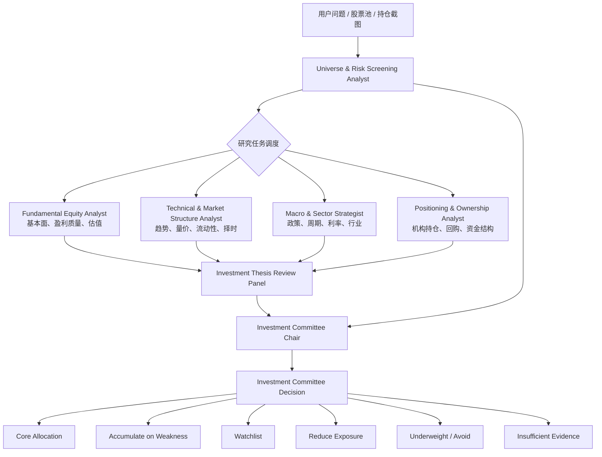
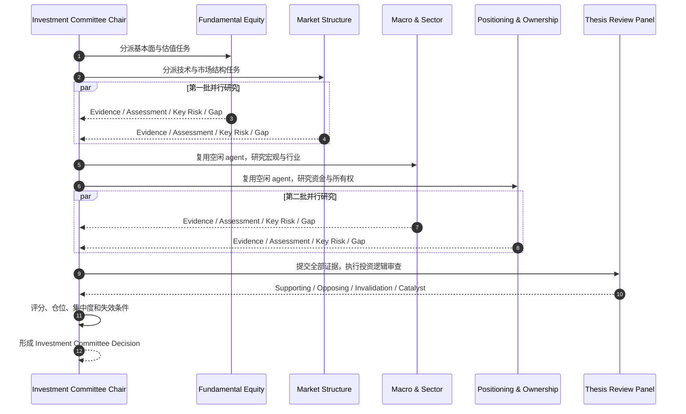

<div align="center">

# Trading Team

### Multi-Agent Equity Research & Portfolio Committee

**让多个专业研究角色独立取证、相互质疑，再由投资委员会形成可审计的组合决策。**

`Fundamental Research` · `Market Structure` · `Macro & Sector` · `Positioning` · `Thesis Review` · `Portfolio Risk`

</div>

---

## 项目简介

Trading Team 是一个面向 Codex 的多智能体证券研究 SKILL。它把单一模型的“一次性判断”升级为机构化投研流程：不同研究角色在独立上下文中收集证据、识别风险和暴露信息缺口，最后由投资委员会主席统一完成评级、仓位与风险控制决策。

它适用于：

- 个股买入、持有、减仓与回避判断
- 股票池筛选、行业聚类与优先级排序
- 持仓截图和盈亏截图复盘
- 基本面、估值、技术面、宏观与资金结构联合研究
- 多空观点审查、催化剂跟踪和投资逻辑证伪
- 组合集中度、行业重叠及宏观因子暴露分析

> 本项目提供研究与决策支持，不承诺收益，也不构成投资建议。

## 投资委员会架构



各研究角色只负责自己的专业判断，不越权给出最终买卖结论。最终建议必须经过证据汇总、冲突消解、反方审查和组合风险评估。

## 多智能体执行逻辑



执行器会尊重当前并发上限：优先并行独立研究任务，并在槽位不足时分批复用已完成的 agent，而不是退化成伪造的“多角色独白”。

## 专业角色与运行标识

| 投资委员会职责 | Agent task name | 核心研究范围 |
| --- | --- | --- |
| Universe & Risk Screening Analyst | `universe_risk_screening` | 证券标准化、行业聚类、流动性和事件风险初筛 |
| Fundamental Equity Analyst | `fundamental_equity` | 商业质量、盈利趋势、现金流、资产负债表和估值 |
| Technical & Market Structure Analyst | `market_structure` | 趋势、量价、相对强弱、支撑阻力和入场风险 |
| Macro & Sector Strategist | `macro_sector` | 利率、汇率、商品、政策、行业周期和市场风格 |
| Positioning & Ownership Analyst | `positioning_ownership` | 机构持仓、内部人、回购、做空、指数与 ETF 资金 |
| Investment Thesis Review Panel | `thesis_review` | 支持与反对论点、证伪条件和重估催化剂 |
| Investment Committee Chair | 主 agent | 综合评级、仓位、组合约束、风险控制和复审机制 |

## 决策框架

每只证券按五个维度进行 1–5 分评价：

```text
Composite = Fundamental Quality × 25%
          + Valuation Attractiveness × 20%
          + Market Structure × 20%
          + Macro & Sector Alignment × 20%
          + (6 - Risk Exposure) × 15%
```

权重会随投资期限调整：短线提高市场结构权重，长期投资提高基本面权重，周期与商品策略提高宏观和行业权重。

| 决策分类 | 专业含义 |
| --- | --- |
| **Core Allocation** | 质量、估值、趋势和风险同时满足核心配置要求 |
| **Accumulate on Weakness** | 投资逻辑成立，但当前价格或技术位置不理想 |
| **Watchlist** | 逻辑可信，仍需等待估值、催化剂或市场结构确认 |
| **Reduce Exposure** | 上行空间收窄、估值扩张、逻辑成熟或集中度过高 |
| **Underweight / Avoid** | 逻辑受损、趋势不利或风险收益比缺乏吸引力 |
| **Insufficient Evidence** | 缺少形成可辩护结论所必需的实时证据 |

## 输出结构

每次完整分析都会形成一份紧凑的投资委员会备忘录：

1. **Committee Review** — 每个专业 mandate 的一句话结论
2. **Universe Analyzed** — 证券、市场、期限和假设
3. **Investment Committee Decision** — 明确的决策分类
4. **Security Recommendation Table** — 理由、主要风险、催化剂和失效条件
5. **Portfolio Construction & Risk Controls** — 仓位、集中度、行业重叠及复审节奏
6. **Evidence as of** — 数据日期和重要信息缺口

## 安装

将仓库克隆到 Codex 的 skills 目录：

```powershell
git clone https://github.com/tallate/trading-team.git "$env:CODEX_HOME\skills\trading-team"
```

如果没有设置 `CODEX_HOME`，可克隆到默认目录：

```powershell
git clone https://github.com/tallate/trading-team.git "$HOME\.codex\skills\trading-team"
```

安装完成后重新打开 Codex 任务，使技能被重新发现。

## 使用示例

显式调用：

```text
Use $trading-team to evaluate whether a moderate-risk investor should buy,
hold, reduce, or avoid 600519.SH over the next 6–12 months.
```

也可以自然语言触发：

```text
请使用多智能体投研委员会分析这组持仓，给出核心配置、观察、减仓和回避名单，
同时说明仓位、行业集中度、催化剂及投资逻辑失效条件。
```

## 数据与风险原则

- 优先使用可验证、注明日期的实时数据和一手资料。
- 明确区分外部事实、用户提供的信息、推断与投资判断。
- 无法获取实时数据时，将相关结论标记为暂定，而不是用模型记忆冒充行情。
- 历史盈亏只作为组合背景，不作为继续买入或卖出的独立依据。
- 不因单只证券看似优质而忽略行业重叠、宏观因子和组合集中度。
- 每项建议必须包含主要风险、催化剂、复审条件和投资逻辑失效条件。

## 项目结构

```text
trading-team/
├── SKILL.md
├── README.md
└── agents/
    └── openai.yaml
```

## Disclaimer

Trading Team is an analytical workflow, not a broker, fiduciary, or licensed financial adviser. Outputs may be incomplete, delayed, or incorrect. Verify material facts independently and make investment decisions according to your own objectives, constraints, and risk tolerance.

