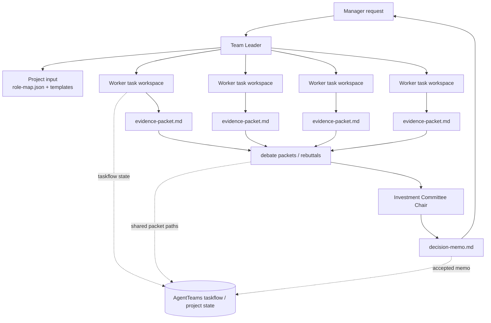

# AgentTeams adapter

This package maps the `trading-team` committee to AgentTeams without placing AgentTeams infrastructure details in the core skill.

## Operating boundary

Use one AgentTeams Team. The Manager assigns the investment request to the Team Leader. The Team Leader creates a bounded DAG, delegates each ready research mandate to one Worker, turns the thesis stage into a two-sided debate, accepts only valid candidate results, and reports the decision memo to the Manager. Workers exchange no final investment decision; the committee chair owns that decision.

```text
Manager -> Team Leader -> independent research Workers -> bull/bear debate -> chair memo -> Manager
```

Use `manager-skill/` for the Team Leader and `worker-skill/` for each research Worker. Distribute each directory as a complete skill package through the Manager so its assignment is recorded and auditable. Put `role-map.json` and the task packet templates in the Team's shared project input, then name their shared paths in the Project/task specifications.

## Package contents

| Path | Purpose |
| --- | --- |
| `role-map.json` | Stable responsibility-to-worker mapping; adapt worker names for each Team. |
| `manager-skill/` | Team Leader protocol for DAG creation, task delegation, and acceptance gates. |
| `worker-skill/` | Research Worker protocol and result contract. |
| `templates/` | Task-ready packet formats. |
| `examples/` | A fictional, data-free protocol example. |
| `scripts/validate_protocol.py` | Offline structural validator for role map and example packets. |

## Deployment sequence

1. Create an AgentTeams Team with one Team Leader and the Worker responsibilities in `role-map.json`.
2. Distribute `manager-skill/` to the Team Leader and `worker-skill/` to research Workers; publish `role-map.json` and `templates/` to the Team's shared project input.
3. Give the Manager a request containing ticker, venue, horizon, portfolio context, permitted data sources, and a decision deadline.
4. Let the Team Leader run the DAG described by `manager-skill/SKILL.md`; task assignment and state must remain AgentTeams taskflow-owned.
5. During thesis review, route the `thesis_bull` and `thesis_bear` roles as a live debate pair so each side responds to the other's strongest argument before the chair decides.
6. Verify the final `decision-memo.md` includes evidence dates, information gaps, risks, and the non-advice disclaimer.

## AgentTeams data flow



The shared state is intentionally file- and taskflow-oriented, not hard-coded to one backend. In practice, AgentTeams may persist those packets in its own project storage, while the committee logic only depends on the packet paths and acceptance rules.

The adapter intentionally does not include Matrix identifiers, credentials, MinIO bucket paths, container commands, or a Kubernetes manifest. AgentTeams creates and owns those environment-specific details.

## Local verification

Run the following from this directory:

```powershell
python scripts/validate_protocol.py
python -m unittest discover -s tests -v
```

These tests validate the portable protocol, not a live AgentTeams cluster or market data.
